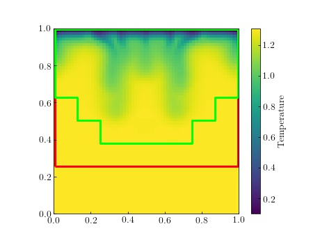

Examples
===========

Inputs
###########
Chombo input files can be read and written using some utility functions

.. code-block:: python

    from chombopy.inputs import read_inputs, write_inputs

    inputs = read_inputs('/path/to/inputs')

    # inputs is a dictionary, with the key values converted to appropriate python objects:
    print(inputs['main.num_cells']) # e.g. [16, 16, 16]
    print(inputs['main.verbosity']) # e.g. 3
    print(inputs['main.plt_prefix']) # e.g. 'plt'

    # You can alter the values
    inputs['main.verbosity'] = 0

    # And write the file back out
    write_inputs('/path/to/new_inputs', inputs)

Reading data and plotting
############################
Chombo plot files can be read using the :py:class:`PltFile` class. An example can be found in examples/example_plotting.py:

.. code-block:: python

    import matplotlib.pyplot as plt
    from chombopy.plotting import PltFile, setup_mpl_latex
    import matplotlib.cm as cm

    pf = PltFile('../tests/data/plt000100.2d.hdf5')

    setup_mpl_latex(14)
    fig = plt.figure()
    ax = plt.gca()
    cmap = 'viridis'
    field = 'Temperature'

    # Get data for the temperature variable on level 2
    for level in pf.get_levels():
        temperature = pf.get_level_data(field, level)

        # temperature is an xarray.DataSet object, which can be plotted using matplotlib
        x, y = pf.get_mesh_grid_for_level(level=level, grow=True)
        ax.pcolormesh(x, y, temperature, cmap=cmap)

        # Or you can do some analysis using the xarray/numpy functionality
        print(temperature.mean())

    pf.plot_outlines(ax)

    cbar = fig.colorbar(cm.ScalarMappable(norm=pf.get_norm(field), cmap=cmap), ax=ax)
    cbar.ax.set_ylabel(field)

    plt.savefig('plt000100.jpg')
    plt.show()
Result:

